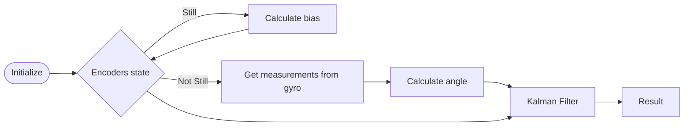

# Scripts used
It is structured with a python script for each component used in the project (encoders, gyro, kalman_object). As python is a programming language that is object oriented, we take advantage of it and the variables are named as atributes of eachone. Finally, all this classes are joined in the final.py, the main script where it's executed the loop.
- $encoder.py$: It is the class of the encoders where it's declared an object Encoder and the variables readed from the Arduino are stored with a set method. 
- $gyro.py$: It is the class of the gyroscope where it's declared an object Gyro and where it's calibrated the gyroscope with the atributes angle, bias and mean stored in the itself object. There, the conection i2c is passed as a parameter, and the range of the mpu is defined.
- $final.py$: This is the py file where the principal loop is running. We import the other classes, initilize all the objects and make a graph with a method using matplotlib. At last, we do a serial connection with the Arduino, and, in the loop, always keep obtaining data to measure the angles and pass them to the kalman filter.

## Why do we use arduino? 
At first, we tried to use our main controller (a Raspberry Pi), to count the ticks of the encoders, however, it was not possible to count all the number of ticks that were produced, we had a miscount. Looking for solutions, we found that the easiest way to avoid the problem as you can see in the answers of [Reading a high speed rotary encoder](https://electronics.stackexchange.com/questions/469008/reading-a-high- speed-rotary-encoder-with-a-raspberry-pi), is to use a microcontroller that is dedicated to counting the ticks of the encoders and, if possible, supporting high-speed hardware-level interrupts. Because we had at our disposal an Arduino Uno which met these characteristics, we chose to use it, therefore we must make a communication between Arduino and Raspberry.

### How do we receive the data?
The code in charge of the serial communication between Arduino and Python is encoder.py, from which we obtain the x and y position in millimeters of the robot (assuming an initial state (0, 0)), the angle (robot heading) expressed in degrees and with three decimal places and finally the state of the robot, a boolean that tells us if the robot is stationary or not.

# Encoders
An encoder is a device that produces signals, with which we can know various aspects of a motor, such as position, direction of rotation and speed; in our case, our encoders have channels $A, B$ and $I$; in addition to having its complements, which are useful to reduce signal noise in the event that we have to process the signal over a long distance, which is not our case. It should also be noted that the channel $I$ indicates when a complete revolution of the encoder axis has been made. In our case, one complete revolution of the wheel of our robot corresponds to 50 ticks of the $I$ channel.

The encoder ticks allow us to determine how much each wheel has turned (both left and right). Since we know the radius of each wheel, we can use the tick data and the wheel radius data to determine the distance traveled by each wheel. Using the following equation:

$$\text{Distance a wheel has traveled} = 2 \pi\cdot\text{radius of the wheel} \cdot\frac{\text{number of ticks}}{\text{number of ticks per revolution}}$ $

Knowing the distance traveled by each wheel helps us determine where the robot is in its environment with respect to an initial location. This process is known as odometry.

## The different ways we intended to use the encoders
In a first instance, we wanted to read the ticks produced in the encoders to then do the odometry calculations in the raspberry, but as we said before, the Raspberry is not able to detect all the ticks of the encoders, which we tried to resolve by using an Arduino, here we will explain what led to this decision.
- Now we got a good reading of the encoder ticks, however, we did not find an efficient way to transmit this information quickly to the Raspberry.
- What we thought was a good solution is to do all the calculations that are related to the encoders on the Arduino, and send the different states of the robot to Raspbery.


## Odometry 
All information in this part is based on [A Primer on Odometry and Motor Control](https://ocw.mit.edu/courses/6-186-mobile-autonomous-systems-laboratory-january-iap-2005/resources/odomtutorial/) from MIT. We call $d_{left}$ the distance rotated by the left wheel over $\Delta t$, and $d_{right}$ is the same measurement for the right wheel. With these two distances we can know in the case that $d_{left}=d_{right}$ that the robot is going in a straight line. If $d_{left}\gt d_{right}$ has rotated to the right, and if $d_{left}\lt d_{right}$ has rotated to the left. We can use these measurements to calculate translation and rotation. 

For simplicity, the speed of the wheels is assumed to be constant, which introduces a small error, which is negligible as long as $\Delta t$ is small. This assumption means that our robot always moves along a circular arc. The length of this arc, $d_{center}$ is given by the mean of $d_{left}$ and $d_{right}$

$$ d_{center} = \frac{d_{left}-d_{right}}{2} $$

We will say that the rotation in radians about $\Delta t$ is $\phi$. Being $r_{left}$, the distance between the center of the movement arc of our robot and its left wheel and $r_{right}$ the same distance for the right wheel. Therefore we have $d_{left} = \phi{ r_{left} }$ and $d_{right} = \phi{ r_{right} }$. Also, $r_{left} = r_{left} + d_{wheels}$ where $d_{wheels}$ is the distance between the robot's wheels. Obtaining the following equation:

$$ \phi = \frac{d_{right}-d_{left}}{d_{wheels}} $$

In short, our odometry equations for $(x^{'}, y^{'}, \theta^{'})$ reduce to:

$$ \begin{array}{rcl}
x^{'} & = & x + d_{center}cos(\theta) \\
y^{'} & = & y + d_{center}sin(\theta) \\
\theta^{'} & = &  \theta + \phi
\end{array} $$


## Encoders Code

As we have said before, we use Arduino to calculate the different states of our robot. For this, we have implemented a small library called *Control*, within it the robot.h header stands out, where the various constants of the robot are defined as the total ticks per revolution, the distance between the wheels, the circumference of the wheels in millimeters, as well as the pins to which we must connect the encoder channels.

```c
//Different constants used for the robot calculation
#ifndef robot_h
#define robot_h

//delta T used for calculations, is defined in microseconds
const long deltaT = 50000;

//Physical robot constants
const int ticksPerRev = 51200, wheelCirc = 768, wheelDist = 287;

//Encoder pins
#define R_ENCODER_A 3 //defined as Arduino digital pin interrupt
#define R_ENCODER_B 5
#define L_ENCODER_A 2 //defined as Arduino digital pin interrupt
#define L_ENCODER_B 4

#endif
```


